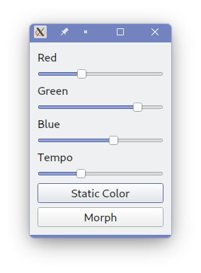

# Dell-G15-Controller
A simple GUI app written in PyQt to control keyboard backlight, power mode and fan speed on Dell G15 (5525 and 5520) Laptops. Untested on any other laptop, but keyboard part can most likely be used with models that have the ```Bus *** Device ***: ID 187c:0550 Alienware Corporation LED controller```. Power related functions are specific to Dell G15 (5525, 5520 and 5515), but might work on similar models.

By default, leds will flash red on low battery, and have half brightness on battery.

Only static color and morph is supported at this time. 
 
**Use at your own risk.**

## Dependencies
- Polkit
- Pyside6
- Udev
- Acpi_call

## Installation

Create an udev rule ```/etc/udev/rules.d/00-aw-elc.rules```. Make sure the user is part of the ```plugdev``` group.

```
/etc/udev/rules.d/00-aw-elc.rules

SUBSYSTEM=="usb", ATTRS{idVendor}=="187c", ATTRS{idProduct}=="0550", MODE="0660", GROUP="plugdev", SYMLINK+="awelc"
```

Polkit is required for power and fan related functionality. If it is not already loaded, load the acpi_call module before launching this application.
```
modprobe acpi_call
```


### Arch Linux
You can install [from the AUR](https://aur.archlinux.org/packages/dell-g15-controller) if on Arch Linux. For dependencies, see the AUR link.

### Other distros
Install the dependencies, as well as `libxcb-cursor0` if required.


## Usage
```
python main.py
```
- For keyboard backlight, choose red, green and blue levels, choose a mode , and press apply. Press the system tray icon to enable/disable keyboard backlight quickly.
- To remove the animation, choose "Off" in keyboard backlight mode. After this, AWCC can be used from Windows.
- For power control, choose a power mode first. Afterwards, fan boost levels can optionally be set. Fan rpm and temperatures are polled every second.

## Screenshots


## License
GNU GENERAL PUBLIC LICENSE v3

## Contributions
Written using the information and code from https://github.com/trackmastersteve/alienfx/issues/41. 

Many thanks to @AlexIII and @T-Troll for their help with the ACPI calls.

